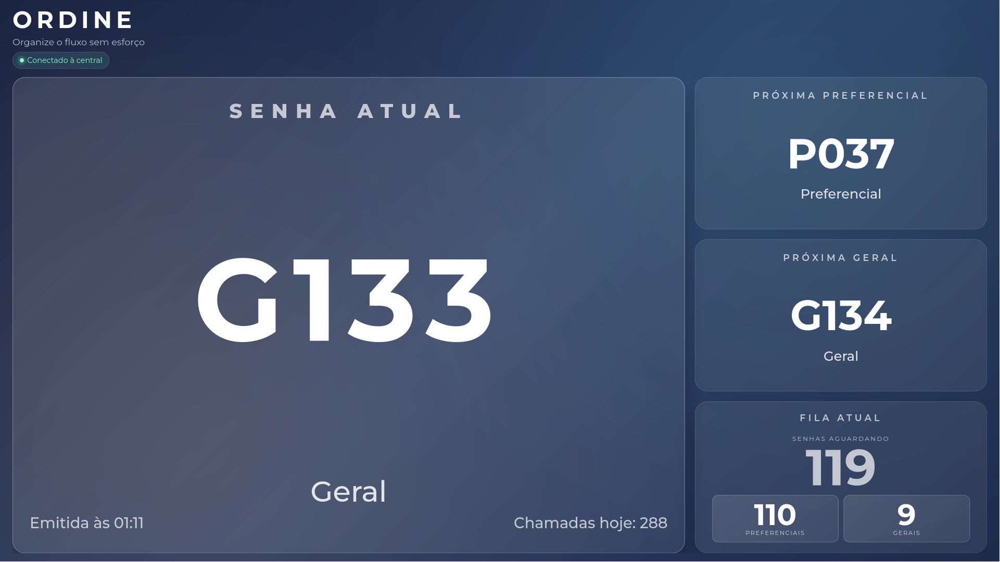
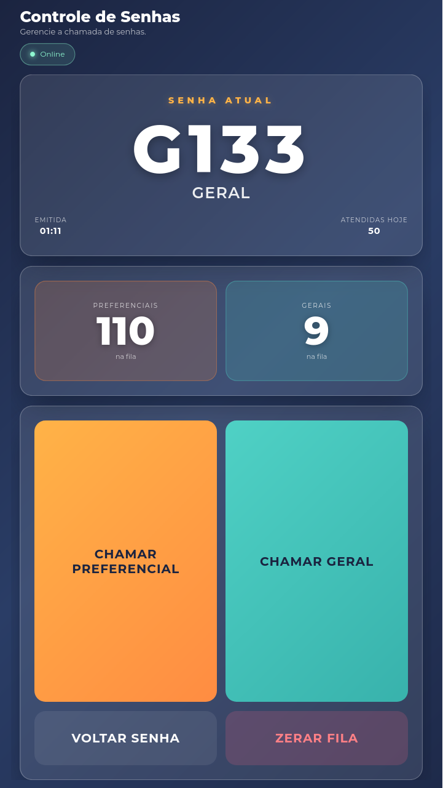
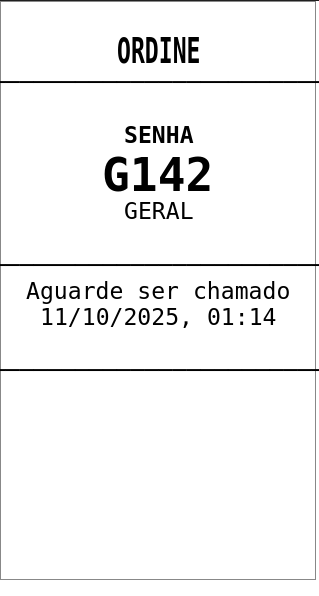

# Ordine – Sistema de Gerenciamento de Senhas

<div align="center">

[](https://nodejs.org/)
[](https://vuejs.org/)
[](https://vitejs.dev/)
[](https://socket.io/)
[](https://opensource.org/licenses/MIT)

Uma plataforma completa e moderna para gerenciamento de filas de atendimento com **backend em Node.js** e **três painéis Vue.js** independentes. Projetado para funcionar em totens de autoatendimento, balcões de atendimento e painéis de TV.

[Características](#-características) •
[Screenshots](#-screenshots) •
[Instalação](#-instalação) •
[Configuração](#-configuração) •
[Uso](#-uso) •
[API](#-api-reference)

</div>

---

## 📋 Índice

- [Características](#-características)
- [Screenshots](#-screenshots)
- [Arquitetura](#-arquitetura)
- [Requisitos](#-requisitos)
- [Instalação](#-instalação)
- [Configuração](#-configuração)
- [Uso](#-uso)
- [API Reference](#-api-reference)
- [Impressão Térmica](#-impressão-térmica)
- [Troubleshooting](#-troubleshooting)
- [Licença](#-licença)

## ✨ Características

### Sistema de Filas Separadas
- 🎫 **Senhas Preferenciais (P001, P002, ...)**: Atendimento prioritário com fila dedicada
- 👤 **Senhas Gerais (G001, G002, ...)**: Atendimento regular com numeração independente
- 📊 **Contadores Separados**: Cada tipo de senha mantém sua própria sequência numérica

### Interface Responsiva e Otimizada
- 📱 **100% Responsivo**: Todas as telas se adaptam perfeitamente a diferentes tamanhos de dispositivos
- 🎨 **Design Moderno**: Tipografia Montserrat, fundos degradê e cartões de vidro
- ⚡ **Animações Sutis**: Transições suaves para mudanças de senha e feedback visual
- ♿ **Acessível**: Suporte a navegação por teclado e redução de movimento

### Painéis Especializados
- 📺 **Painel de Exibição (TV)**: Layout otimizado para telas grandes com senha atual em destaque
- 📱 **Painel de Controle (Tablet)**: Interface vertical com botões grandes e touch-friendly
- 🎫 **Totem de Emissão**: Interface touch otimizada para autoatendimento

### Recursos Avançados
- 🔄 **Atualização em Tempo Real**: WebSocket (Socket.IO) para sincronização instantânea
- 🖨️ **Impressão Térmica**: Suporte a impressoras ESC/POS via rede
- 🌐 **Acesso Remoto**: Configure para acessar de qualquer dispositivo na rede local
- 📊 **Histórico**: Acompanhe as últimas senhas chamadas

## 📸 Screenshots

### Painel de Exibição (TV)

*Visualização em tempo real da senha atual e próximas senhas da fila*

### Painel de Controle (Tablet)

*Interface de gerenciamento com controles de chamada e visualização da fila*

### Totem de Emissão

*Interface de autoatendimento para emissão de senhas*

### Emissão de Senhas
<div align="center">
  
  
</div>

*Confirmação de emissão de senhas Geral e Preferencial*

### Impressão de Comprovante

*Exemplo de comprovante impresso em impressora térmica*

## 🏗️ Arquitetura

## 🏗️ Arquitetura

O sistema é composto por 4 componentes principais que se comunicam via REST API e WebSocket:

```
┌────────────────────────────────────────────────────────────┐
│                     ORDINE - ARQUITETURA                   │
├────────────────────────────────────────────────────────────┤
│                                                            │
│  ┌──────────────┐        ┌──────────────────────┐          │
│  │   Backend    │◄──────►│   Display Panel      │          │
│  │  (Node.js)   │        │   (Vue.js + Vite)    │          │
│  │   :8000      │        │      :8001           │          │
│  └──────┬───────┘        └──────────────────────┘          │
│         │                                                  │
│         │ WebSocket                                        │
│         │ (Socket.IO)                                      │
│         │                                                  │
│         ├──────────────►┌──────────────────────┐           │
│         │               │  Control Panel       │           │
│         │               │  (Vue.js + Vite)     │           │
│         │               │     :8002            │           │
│         │               └──────────────────────┘           │
│         │                                                  │
│         └──────────────►┌──────────────────────┐           │
│                         │  Ticket Issuer       │           │
│                         │  (Vue.js + Vite)     │           │
│                         │     :8003            │           │
│                         └──────────────────────┘           │
│                                                            │
└────────────────────────────────────────────────────────────┘
```

### Componentes

- **🔧 Backend API (Porta 8000)**
  - Gerenciamento de filas com contadores separados (PXXX e GXXX)
  - Endpoints REST para operações CRUD
  - WebSocket para atualizações em tempo real
  - Integração com impressora térmica ESC/POS

- **📺 Display Panel (Porta 8001)**
  - Interface estilo TV para visualização pública
  - Exibe senha atual em destaque
  - Mostra próximas senhas por categoria
  - Histórico das últimas senhas chamadas
  - Atualização instantânea via WebSocket

- **📱 Control Panel (Porta 8002)**
  - Interface de gerenciamento para operadores
  - Chamadas separadas de senhas preferenciais e gerais
  - Controles: próxima senha, senha anterior, resetar fila
  - Visualização completa do status da fila
  - Contadores por categoria

- **🎫 Ticket Issuer (Porta 8003)**
  - Interface de autoatendimento
  - Emissão de senhas gerais e preferenciais
  - Feedback visual e sonoro
  - Layout otimizado para impressão
  - Suporte a telas touch

## 🔧 Requisitos

## 🔧 Requisitos

- **Node.js** 18 ou superior
- **NPM** (ou pnpm/yarn)
- **Navegador moderno** (Chrome, Firefox, Safari, Edge)
- **(Opcional)** Impressora térmica ESC/POS com suporte de rede

## 📦 Instalação

### Instalação Rápida (Workspaces NPM)

### Instalação Rápida (Workspaces NPM)

Clone o repositório e instale todas as dependências de uma vez:

```bash
# Clone o repositório
git clone <url-do-repositorio>
cd ordine

# Instale todas as dependências
npm install
```

### Instalação Manual (Projeto por Projeto)

Alternativamente, você pode instalar as dependências de cada projeto separadamente:

```bash
# Backend
cd backend && npm install

# Painéis Frontend
cd ../apps/display-panel && npm install
cd ../control-panel && npm install
cd ../ticket-issuer && npm install
```

## ⚙️ Configuração

### Variáveis de Ambiente

Todas as variáveis de ambiente estão centralizadas em um único arquivo `.env` na raiz do projeto.

**1. Copie o arquivo de exemplo:**

```bash
cp .env.example .env
```

### 🏠 Configuração para Desenvolvimento Local

Para usar o sistema apenas na máquina local (desenvolvimento):

```env
# Backend - Servidor API
PORT=8000
BACKEND_HOST=0.0.0.0
ALLOWED_ORIGINS=*

# Frontend - URLs da API
VITE_API_BASE=http://localhost:8000
VITE_SOCKET_URL=http://localhost:8000
VITE_HOST=0.0.0.0

# Portas dos Painéis
VITE_DISPLAY_PORT=8001   # Painel de Display (TV)
VITE_CONTROL_PORT=8002   # Painel de Controle
VITE_ISSUER_PORT=8003    # Totem de Emissão
```

### 🌐 Configuração para Acesso Remoto

### 🌐 Configuração para Acesso Remoto

Para acessar os painéis de outros dispositivos (tablets, TVs, celulares) na mesma rede local:

**1. Descubra o IP da sua máquina:**

```bash
# Linux/Mac
hostname -I
# ou
ip addr show | grep "inet "

# Windows
ipconfig
```

Exemplo de IP: `192.168.1.100`

**2. Configure o `.env` com o IP da máquina:**

```env
# Backend
PORT=8000
BACKEND_HOST=0.0.0.0
ALLOWED_ORIGINS=*

# Frontend - IMPORTANTE: Use o IP da sua máquina
VITE_API_BASE=http://192.168.1.100:8000
VITE_SOCKET_URL=http://192.168.1.100:8000
VITE_HOST=0.0.0.0

# Portas dos Painéis
VITE_DISPLAY_PORT=8001
VITE_CONTROL_PORT=8002
VITE_ISSUER_PORT=8003
```

**3. Acesse de outros dispositivos:**

| Painel | URL |
|--------|-----|
| 📺 Display (TV) | `http://192.168.1.100:8001` |
| 📱 Controle | `http://192.168.1.100:8002` |
| 🎫 Totem | `http://192.168.1.100:8003` |
| 🔧 API | `http://192.168.1.100:8000` |

> **💡 Dica:** Use o script `./get-ip.sh` para descobrir automaticamente o IP e ver as URLs de acesso.

> **📝 Nota:** O arquivo `.env` na raiz é compartilhado por todos os apps. Não é necessário criar arquivos `.env` separados.

## 🚀 Uso

### Iniciar Todos os Serviços

**Opção 1 - Script de desenvolvimento:**

```bash
./start-dev.sh
```

**Opção 2 - NPM (recomendado):**

```bash
npm run dev
```

Isso iniciará todos os 4 serviços em paralelo:
- ✅ Backend API em `http://localhost:8000`
- ✅ Display Panel em `http://localhost:8001`
- ✅ Control Panel em `http://localhost:8002`
- ✅ Ticket Issuer em `http://localhost:8003`

### Iniciar Serviços Individuais

```bash
# Terminal 1 - Backend API
cd backend
npm run dev

# Terminal 2 - Painel de Display
cd apps/display-panel
npm run dev

# Terminal 3 - Painel de Controle
cd apps/control-panel
npm run dev

# Terminal 4 - Totem de Emissão
cd apps/ticket-issuer
npm run dev
```

### Build para Produção

```bash
# Build de todos os projetos
npm run build

# Build individual
npm run build:backend
npm run build:display
npm run build:control
npm run build:issuer
```

## 📚 API Reference

## 📚 API Reference

### Endpoints REST

| Método | Endpoint | Descrição | Corpo da Requisição |
|--------|----------|-----------|---------------------|
| `GET` | `/api/health` | Healthcheck do servidor | - |
| `GET` | `/api/tickets/state` | Estado completo da fila | - |
| `POST` | `/api/tickets` | Emite nova senha | `{ "service": "Geral" \| "Preferencial" }` |
| `POST` | `/api/tickets/next` | Chama próxima senha | `{ "category": "geral" \| "preferencial" \| "automatic" }` |
| `POST` | `/api/tickets/previous` | Retorna para senha anterior | - |
| `POST` | `/api/tickets/reset` | Reinicia fila completamente | - |

### Exemplos de Uso

#### Emitir Senha Geral

```bash
curl -X POST http://localhost:8000/api/tickets \
  -H "Content-Type: application/json" \
  -d '{"service": "Geral"}'
```

**Resposta:**
```json
{
  "ticket": {
    "id": "G001",
    "code": "G001",
    "number": 1,
    "service": "Geral",
    "type": "geral",
    "issuedAt": "2025-10-11T12:00:00.000Z"
  },
  "state": { ... },
  "message": "Senha criada e adicionada à fila.",
  "print": { "printed": true }
}
```

#### Emitir Senha Preferencial

```bash
curl -X POST http://localhost:8000/api/tickets \
  -H "Content-Type: application/json" \
  -d '{"service": "Preferencial"}'
```

**Resposta:**
```json
{
  "ticket": {
    "id": "P001",
    "code": "P001",
    "number": 1,
    "service": "Preferencial",
    "type": "preferencial",
    "issuedAt": "2025-10-11T12:00:00.000Z"
  },
  "state": { ... },
  "message": "Senha criada e adicionada à fila.",
  "print": { "printed": true }
}
```

#### Chamar Próxima Senha Preferencial

```bash
curl -X POST http://localhost:8000/api/tickets/next \
  -H "Content-Type: application/json" \
  -d '{"category": "preferencial"}'
```

#### Obter Estado da Fila

```bash
curl http://localhost:8000/api/tickets/state
```

**Resposta:**
```json
{
  "currentTicket": {
    "id": "P001",
    "code": "P001",
    "number": 1,
    "service": "Preferencial",
    "type": "preferencial"
  },
  "nextTicket": { ... },
  "nextPreferencial": { ... },
  "nextGeral": { ... },
  "queue": [ ... ],
  "queueLength": 5,
  "queueByType": {
    "geral": 3,
    "preferencial": 2
  },
  "history": [ ... ],
  "issuedCount": 10,
  "issuedCountGeral": 7,
  "issuedCountPreferencial": 3,
  "updatedAt": "2025-10-11T12:00:00.000Z"
}
```

### WebSocket Events

#### Conectar ao WebSocket

```javascript
import { io } from 'socket.io-client';

const socket = io('http://localhost:8000');

// Receber atualizações em tempo real
socket.on('ticket:update', (state) => {
  console.log('Estado atualizado:', state);
});
```

#### Eventos Disponíveis

| Evento | Descrição | Payload |
|--------|-----------|---------|
| `ticket:update` | Enviado quando o estado da fila muda | Estado completo da fila |
| `connection` | Cliente conectado ao servidor | - |
| `disconnect` | Cliente desconectado do servidor | - |

## 🖨️ Impressão Térmica

## 🖨️ Impressão Térmica

O sistema suporta impressão automática de comprovantes em impressoras térmicas ESC/POS via rede.

### Configuração da Impressora

Todas as configurações ficam em `backend/src/printer.js`:

```javascript
const printerConfig = {
  enabled: true,  // Habilitar/desabilitar impressão
  connection: {
    type: 'network',
    ip: '192.168.1.100',  // IP da impressora
    port: 9100             // Porta padrão ESC/POS
  },
  options: {
    encoding: 'CP860'      // Encoding da impressora
  }
};
```

### Variáveis de Ambiente (Opcional)

Você também pode configurar via variáveis de ambiente:

```env
PRINTER_ENABLED=true
PRINTER_IP=192.168.1.100
PRINTER_PORT=9100
PRINTER_ENCODING=CP860
```

### Formato do Comprovante

O comprovante impresso contém:
- 🏢 Nome do estabelecimento
- 🎫 Código da senha (P001, G001, etc.)
- 📋 Tipo de atendimento (Geral/Preferencial)
- 📅 Data e hora de emissão
- 📊 Posição na fila

### Tratamento de Erros

Se a impressão falhar, o sistema:
- ✅ Ainda emite a senha normalmente
- ⚠️ Registra o erro no console
- 📊 Retorna o status da impressão na resposta da API

### Sistema de Numeração de Senhas

#### Filas Separadas

O sistema mantém **dois contadores independentes**:

- **Senhas Gerais (G)**: G001, G002, G003, ...
- **Senhas Preferenciais (P)**: P001, P002, P003, ...

#### Vantagens

✅ **Sem Confusão**: Cada tipo de senha tem sua própria sequência  
✅ **Identificação Visual**: Fácil distinguir o tipo pela letra  
✅ **Contadores Independentes**: Reset de um não afeta o outro  
✅ **Priorização Clara**: Senhas P sempre têm prioridade

#### Exemplo de Fluxo

```
Cliente 1 solicita Geral       → G001
Cliente 2 solicita Preferencial → P001
Cliente 3 solicita Geral       → G002
Cliente 4 solicita Preferencial → P002
Cliente 5 solicita Geral       → G003

Fila atual: P001, G001, P002, G002, G003
          └─── preferenciais chamadas primeiro
```

## 🐛 Troubleshooting

## 🐛 Troubleshooting

### ❌ Não consigo acessar os painéis de outros dispositivos

**Possíveis causas e soluções:**

1. **Firewall bloqueando as portas**

   ```bash
   # Linux (UFW)
   sudo ufw allow 8000:8003/tcp
   
   # Linux (firewalld)
   sudo firewall-cmd --add-port=8000-8003/tcp --permanent
   sudo firewall-cmd --reload
   
   # Windows
   # Abra as portas 8000-8003 no Windows Firewall
   ```

2. **Configuração incorreta do `.env`**

   Verifique se:
   - ✅ `BACKEND_HOST=0.0.0.0`
   - ✅ `VITE_HOST=0.0.0.0`
   - ✅ `VITE_API_BASE` e `VITE_SOCKET_URL` usam o IP da máquina (não localhost)

3. **Dispositivos não estão na mesma rede**

   Certifique-se que todos os dispositivos estão conectados à mesma rede Wi-Fi/LAN.

4. **Testar conectividade**

   ```bash
   # De outro dispositivo
   curl http://SEU_IP:8000/api/health
   # Deve retornar: {"status":"ok","uptime":...}
   ```

5. **Reiniciar serviços após alterar `.env`**

   ```bash
   # Pare todos (Ctrl+C)
   # Depois reinicie
   npm run dev
   ```

### ⚡ WebSocket não conecta de outros dispositivos

- ✅ `VITE_SOCKET_URL` deve usar o IP da máquina (não localhost)
- ✅ `ALLOWED_ORIGINS=*` permite qualquer origem (desenvolvimento)
- ⚠️ Em produção, liste IPs específicos: `ALLOWED_ORIGINS=http://IP1:8001,http://IP2:8002`

### 🖨️ Impressora não está imprimindo

1. **Verifique se está habilitada**
   - `enabled: true` em `backend/src/printer.js`
   - ou `PRINTER_ENABLED=true` no `.env`

2. **Teste conectividade com a impressora**
   ```bash
   ping IP_DA_IMPRESSORA
   telnet IP_DA_IMPRESSORA 9100
   ```

3. **Verifique os logs do backend**
   - Erros de impressão aparecem no console do backend

4. **Confirme o encoding correto**
   - Teste diferentes encodings: `CP860`, `CP850`, `UTF-8`

### 📱 Tela branca ou erro 404

- ✅ Verifique se todos os serviços estão rodando
- ✅ Confirme as portas corretas no navegador
- ✅ Limpe cache do navegador (Ctrl+Shift+Del)
- ✅ Tente modo anônimo/privado

### 🔄 Atualizações não aparecem em tempo real

- ✅ Verifique conexão WebSocket no console do navegador
- ✅ Recarregue a página (F5)
- ✅ Verifique se o backend está rodando

## 🎯 Melhores Práticas

### Desenvolvimento
- ✅ Use `npm run dev` para desenvolvimento local
- ✅ Mantenha o `.env` configurado corretamente
- ✅ Monitore os logs do backend para erros

### Produção
- ✅ Configure `ALLOWED_ORIGINS` com IPs específicos
- ✅ Use HTTPS com certificados SSL
- ✅ Configure backup automático do estado da fila
- ✅ Monitore logs e performance
- ✅ Use PM2 ou similar para gerenciar processos

### UX e Acessibilidade
- ✅ Design responsivo para todos os tamanhos de tela
- ✅ Botões grandes e touch-friendly
- ✅ Alto contraste para melhor legibilidade
- ✅ Feedback visual e sonoro nas ações
- ✅ Suporte a navegação por teclado

## 🚀 Próximos Passos

Sugestões para expandir o sistema:

- [ ] 💾 Persistência em banco de dados (PostgreSQL, MongoDB, Redis)
- [ ] 🔐 Autenticação e autorização (JWT)
- [ ] 🏢 Suporte a múltiplas filas/guichês
- [ ] 📊 Dashboard de analytics e relatórios
- [ ] 🔔 Notificações push/SMS
- [ ] 🌍 Internacionalização (i18n)
- [ ] 🐳 Docker Compose para deploy
- [ ] 📱 App mobile nativo (React Native/Flutter)
- [ ] 🎤 Chamada por voz (Text-to-Speech)
- [ ] 📹 Integração com câmeras de segurança

## 🤝 Contribuindo

Contribuições são bem-vindas! Sinta-se à vontade para:

1. 🍴 Fork o projeto
2. 🔨 Criar uma branch para sua feature (`git checkout -b feature/AmazingFeature`)
3. ✅ Commit suas mudanças (`git commit -m 'Add some AmazingFeature'`)
4. 📤 Push para a branch (`git push origin feature/AmazingFeature`)
5. 🔃 Abrir um Pull Request

## 📄 Licença

## 📄 Licença

Este projeto está licenciado sob a **MIT License** - veja o arquivo [LICENSE](LICENSE) para detalhes.

---

<div align="center">

**Desenvolvido com ❤️ para otimizar o atendimento ao público**

[⬆ Voltar ao topo](#ordine--sistema-de-gerenciamento-de-senhas)

</div>
